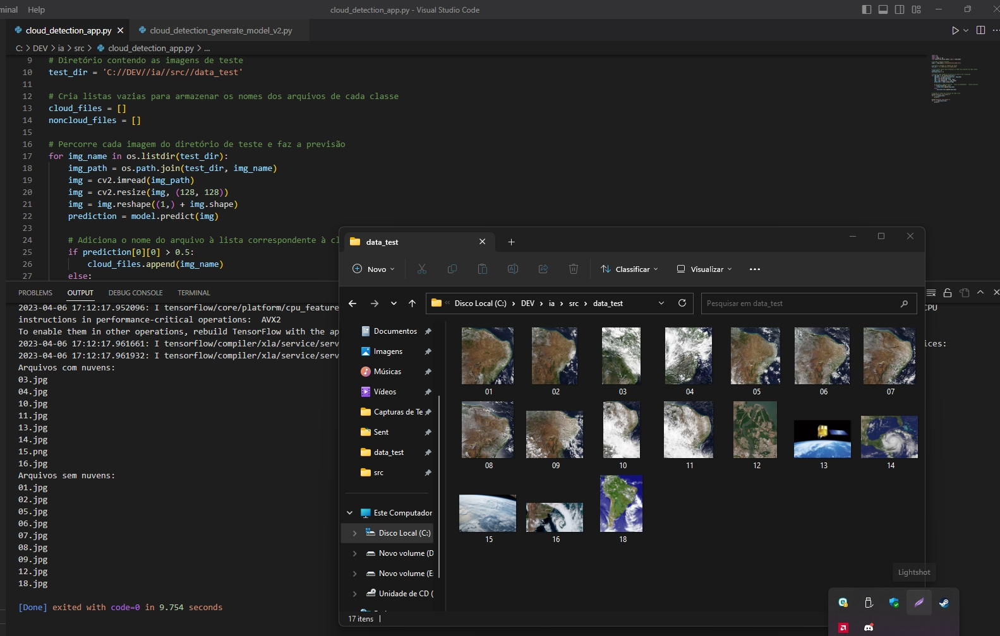

# clouds-classifier
en-us This project uses Python 3.8, TensorFlow and OpenCV to train a cloud detection model using satellite images.
Projeto de Detecção de Nuvens

pt-br - Este projeto utiliza Python 3.8, TensorFlow e OpenCV para gerar um modelo de detecção de nuvens usando imagens de satélites.

## Requisitos
Python 3.8
TensorFlow
NumPy
OpenCV
scikit-learn

## Instalação
1 - Certifique-se de que o Python 3.8 está instalado em seu ambiente. Caso contrário, faça o download e instale o Python 3.8 a partir do site oficial do Python.

2 - Instale as bibliotecas necessárias executando o seguinte comando no terminal:

```pip install numpy==1.19.5 tensorflow==2.6.0 opencv-python==4.5.3.56 scikit-learn==0.24.2```

## Executando o projeto

1 - Clone este repositório ou baixe os arquivos do projeto.

2 - Coloque suas imagens em um diretório seguindo a estrutura abaixo:

```data/
  ├── category1/
  │   ├── image1.jpg
  │   ├── image2.jpg
  │   ├── ...
  │
  ├── category2/
  │   ├── image1.jpg
  │   ├── image2.jpg
  │   ├── ...
```

3 - Atualize a variável data_dir no script do projeto com o caminho absoluto do diretório de dados.

```data_dir = 'C://DEV//ia//src//data'```

4 - Execute o script do projeto:

Esse script irá gerar o seu modelo:

``` cloud_detection_generate_model_v2.py ```

ou

``` cloud_detection_generate_model_v5.py ```

Após a conclusão do treinamento, o modelo treinado será salvo como cloud_detection_model.h5.


5 - Execute 

``` cloud_detection_app_v5.py ```

Certifique-se que dentro desse script esteja apontando para pasta data_test correta.



### Fonte de dados (satélite amazonia-1)

http://www.dgi.inpe.br/catalogo/

## Esse Readme foi gerado com CHAT-GPT :)
